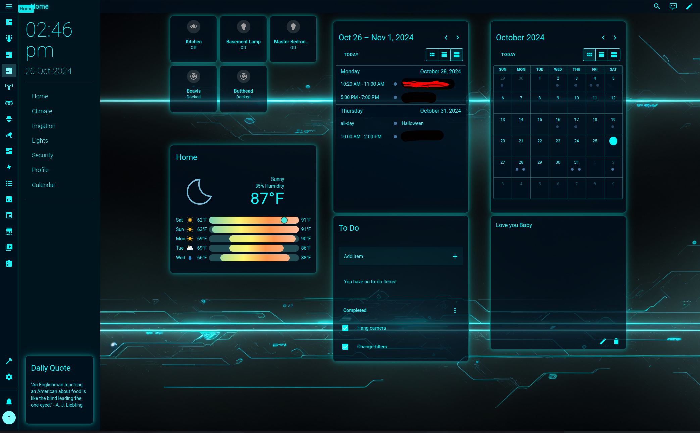
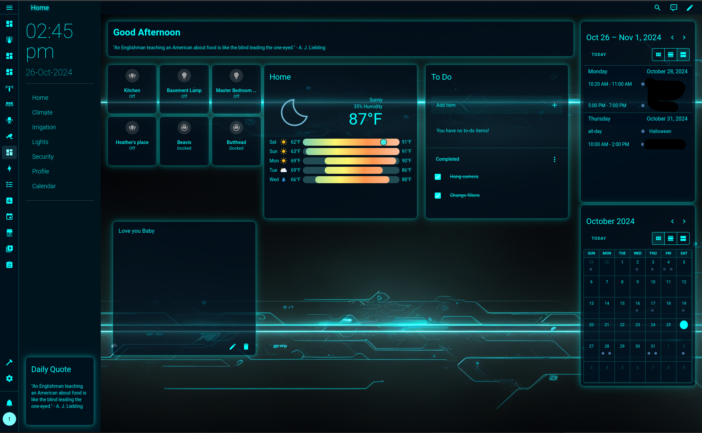

# 🚀 Enhanced Biofects Theme
**Enhanced Biofects Theme** is a Home Assistant theme showcases a sleek, futuristic design with a neon blue color scheme and glowing accents. The theme features a dark background with subtle circuit patterns, giving the dashboard a high-tech, sci-fi look. Cards appear to float with illuminated borders, enhancing readability and adding depth. Elements such as the sidebar, clock, and interactive panels have consistent color highlights, creating a cohesive, immersive experience. The dashboard layout efficiently organizes information, including a personalized greeting, daily quotes, weather data, and a to-do list, all accessible at a glance in a visually striking interface. **[WIP]**

<p align="center">
  
  
</p>
---
## 💸 Donations Welcome!
If you find this theme useful, please consider donating. Your support is greatly appreciated!

[](https://www.paypal.com/cgi-bin/webscr?cmd=_s-xclick&hosted_button_id=TWRQVYJWC77E6)
---

## 🔍 About this Theme
 **Enhanced Biofects Theme** This custom Home Assistant theme combines a sleek, high-tech look with a practical layout, designed to make smart home interactions more enjoyable and immersive.

## Features
- Sci-Fi Aesthetic: A dark background with neon blue accents and circuit-like patterns creates a sophisticated, futuristic vibe.
- Enhanced Readability: Neon-glowing borders around cards and text improve readability, especially in low-light conditions.
- Optimized Layout: Key elements such as weather, to-do lists, calendar events, and daily quotes are prominently displayed for easy access.
- Personalized Design: Adds a "wow" factor to your dashboard, turning it into a unique expression of style.
- Why Use This Theme?
-- This theme is ideal for anyone looking to elevate their Home Assistant dashboard with an immersive, sci-fi inspired interface that enhances both aesthetics and usability. Perfect for those who want a personalized, visually appealing, and organized smart home experience.

## Notes
My Home Assistant runs in Docker on a server. I don't use the supervised version, nor do I send any data to Home Assistant servers. This is my personal choice, despite it requiring more manual management.
  
  <strong style="color:red;">I don’t know how it works with HAOS.</strong>

- I prioritize securing my network by blocking **phone home** calls from IoT devices, ensuring data privacy.
- My Home Assistant setup includes an array of devices, with plans to expand further. Here’s a snapshot of what I manage:

    - 💡 Hue
    - 🏠 Tuya
    - 📊 Grafana for monitoring
    - 🎞 Emby for media
    - 🚪 Door locks
    - 🔒 Cameras
    - 💻 Local AI (on server)
    - 🚦 Pi Hole for ad-blocking
    - 🖥 Full network & server monitoring, including GPU & storage
    - 🌀 Fans
    - And much more to come!


---

## 🔧 Plugins I Use to Achieve My Layout
These are the essential plugins that helped me craft my use of the Enhanced Biofects Theme experience:
- [ha-biofects-fullmenu](https://github.com/biofects/ha-biofects-fullmenu) - My Home page is a dynamic full page animated enu.
- [simple_sticky_note](https://github.com/biofects/simple_sticky_note) - A simple card to leave real time messages in the card, without leaving the page or popups.
- [Sidebar Card](https://github.com/DBuit/sidebar-card) – For an easy-to-navigate sidebar.
- [Wall Panel](https://github.com/j-a-n/lovelace-wallpanel) – A powerful screen saver.
- [Kiosk Mode](https://github.com/maykar/kiosk-mode) – Hides UI elements for a streamlined experience.
- [Card Mod](https://github.com/thomasloven/lovelace-card-mod) – Add custom styling to cards.
- [layout-card](https://github.com/thomasloven/hass-config/wiki/Lovelace-Plugins) - For my custom layouts

## 🔧 Optional plugins I validated that work
- [Restriction Card](https://github.com/iantrich/restriction-card) – Lock access to things like thermostats. 🔒
- [Unifi Gateway](https://github.com/custom-components/sensor.unifigateway)
- [Unifi Counter Sensors](https://github.com/clyra/unifics)
- [Clock Weather Card](https://github.com/pkissling/clock-weather-card)
- [Kiosk Mode](https://github.com/maykar/kiosk-mode) – Hides UI elements for a streamlined experience.

---

## 🚀 Installation Instructions

### HACS (Recommended)

1. Ensure [HACS](https://hacs.xyz/) is installed in your Home Assistant.
2. Open the HACS panel, click the three dots in the top-right corner, and select **"Custom Repositories."**
3. Add the following URL as a **Custom Repository**:  
   [https://github.com/biofects/Enhanced-Biofects](https://github.com/biofects/Enhanced-Biofects)  
   and select **"Theme"** as the category.
4. Click **"Add,"** then navigate to the **"Theme"** tab, click **"+ Explore & Download Repositories"** and search for "Biofects."
5. Install the theme and restart Home Assistant.
6. Go to **User Profile** in Home Assistant and select the Enhanced Biofects theme.
7. Set up background image: (Need to figure out how to have hacs place the image in the correct folder)
   ```
   # Create backgrounds directory if it doesn't exist
   mkdir -p /config/www/backgrounds
   ```
   ```
   # Copy background image
   copy enhanced-biofects.png /config/www/backgrounds/enhanced-biofects.png
8. Restart Home Assistant

---
## Manual installation
1. Create Theme Folder 
    ```
    # Create Enhanced Biofects Theme Folder
    mkdir -p /config/themes/Enhanced-Biofects
    ```
2. Copy the file `Enhanced-Biofects.yaml` into your Home Assistant themes folder
    ```
    # Copy the file `Enhanced-Biofects.yaml` into your Home Assistant themes folder
    cp Enhanced-Biofects.yaml /config/themes/Enhanced-Biofects
    ```
3. Set up background image: (Need to figure out how to have hacs place the image in the correct folder)
   ```
   # Create backgrounds directory if it doesn't exist
   mkdir -p /config/www/backgrounds
   ```
   ```
   # Copy background image
   copy enhanced-biofects.png /config/www/backgrounds/enhanced-biofects.png
4. Restart Home Assistant


## 🛠 How I Created My Layouts

To get the layout I wanted with the Enhanced Biofects Theme, I combined various plugins and customization:

1. Updated each dashboard to support **Wall Panel**, **Sidebar Card** and **Kiosk Mode**.
2. YAML for content and views should be placed above the dashboard views.
3. Example using UI and Sections:  
   [ui.yaml](./examples/ui.yaml)
4. Example With a custom header and Greeting Sensor:  
   [lovelace-dashboard.yaml](./examples/lovelace-dashboard.yaml)
- Please note for the Custom Header with greeting and Quote you will need some additional templates and sensors in your configuration yaml files.
    [otherconfigs.yaml](./examples/otherconfigs.yaml)
---

## 🐛 Support & Issues
If you encounter bugs or have feature requests, feel free to [open an issue](https://github.com/biofects/Enhanced-Biofects/issues) on the GitHub repository.

---

## 📜 License
This project is licensed under the MIT License.
